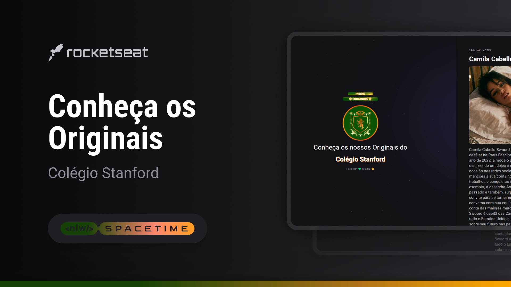

## 🖥️ Projeto

Esse é meu primeiro projeto web, onde utilizei de um curso disponibilizado gratuitamente pela RocketSeat, ensinando o uso das linguagens HTML e CSS e suas diversas funcionalidades. Tomei a liberdade de modificar o projeto original em algumas partes e também o seu propósito inicial (que era o de ser criado uma cápsula do tempo). Meu projeto utilizou os dados recebidos de uma fanfic que leio para que assim eu ficasse mais motivada a realizá-lo, no fim das contas o que importa mesmo são as tecnologias aprendidas e seu uso 😉

## 📱 Tecnologias

- HTML
- CSS
- Git e Github

## 🏷️ Layout

Você pode visualizar o layout do projeto através [desse link](<https://www.figma.com/file/ZweYJbehMsxpBEUuZ8ySnu/C%C3%A1psula-do-tempo-%E2%80%A2-Trilha-Explorer-(Community)-(Copy)?type=design&node-id=306%3A3&t=tyOX0cLkfJaaCaax-1>).
É necessário ter uma conta no [Figma](https://www.figma.com)
